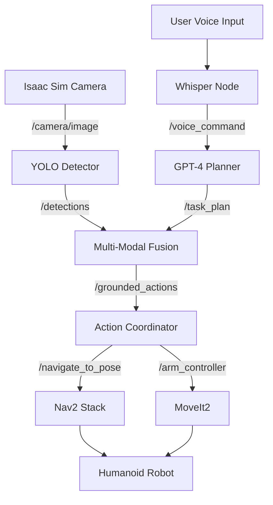
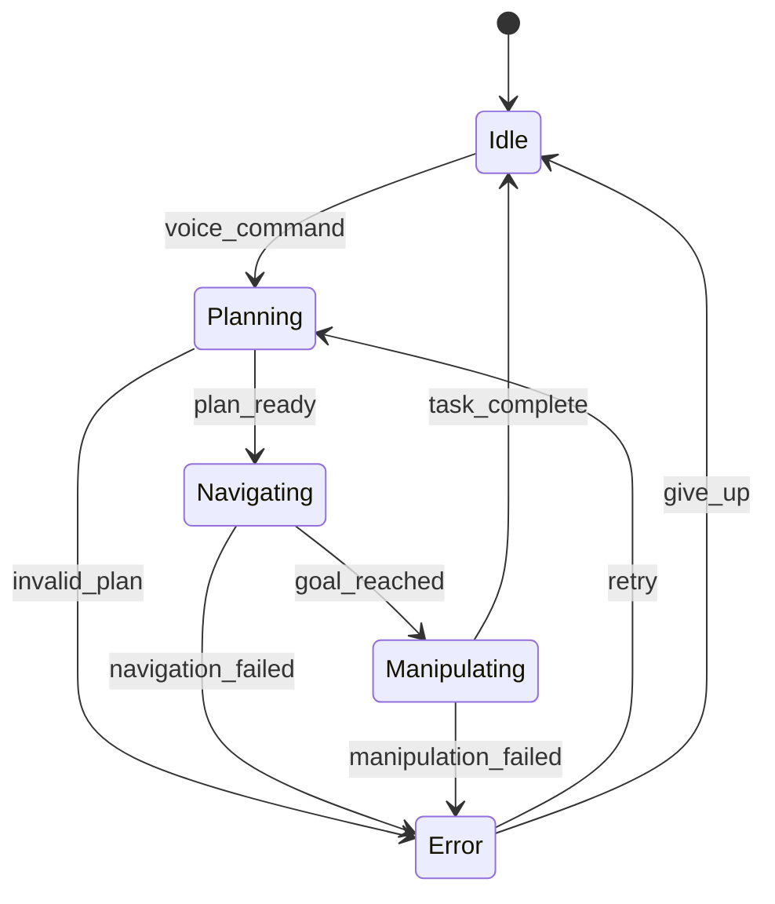

# Capstone Project - Image Assets

This directory contains system architecture diagrams, integration flowcharts, and screenshots for the autonomous humanoid assistant capstone project.

## Image List

### Architecture Diagrams

#### 1. Complete System Architecture (`system_architecture.png`)
**Description**: High-level architecture showing all major components and data flow.
- Layers: User Interface → Cognitive → Perception → Control → Hardware/Simulation
- All ROS 2 nodes with their publishers/subscribers
- Isaac Sim integration
- External APIs (OpenAI, sensors)
- **Recommended dimensions**: 2400x1600 or SVG
- **Tools**: Draw.io, Lucidchart, or PlantUML

#### 2. ROS 2 Computational Graph (`ros2_node_graph.png`)
**Description**: Complete ROS 2 node and topic graph.
- All nodes from full_system_launch.py
- Topic names and message types
- Action servers and service calls
- TF tree structure
- **Format**: Generated from `rqt_graph` or `ros2 run rqt_graph rqt_graph`
- **Recommended dimensions**: 3000x2000 (large graph)

#### 3. Data Flow Diagram (`data_flow_diagram.png`)
**Description**: Step-by-step data transformation from user input to robot action.
- Voice audio → Text → Task plan → Actions → Motion
- Show processing time at each stage
- Highlight GPU vs CPU processing
- **Recommended dimensions**: 2000x1200

#### 4. Multi-Modal Fusion Architecture (`multimodal_fusion_detail.png`)
**Description**: Detailed view of how voice, vision, and gesture are fused.
- Input preprocessing
- Feature extraction (Whisper embeddings, CLIP features, hand landmarks)
- Fusion strategy (early vs late fusion)
- Attention mechanism
- Output: grounded actions
- **Recommended dimensions**: 1800x1200

### Integration Diagrams

#### 5. Isaac Sim ROS 2 Integration (`isaac_ros2_integration.png`)
**Description**: How Isaac Sim connects to ROS 2 ecosystem.
- Isaac Sim simulation loop
- ROS 2 bridge components
- Published topics (camera, IMU, joints, TF)
- Subscribed topics (cmd_vel, joint_commands)
- Synchronization and timing
- **Recommended dimensions**: 1600x1200

#### 6. Nav2 Integration (`nav2_integration.png`)
**Description**: Navigation stack integration with perception and planning.
- Costmap sources (sensors, static map)
- Planner selection
- Controller execution
- Recovery behaviors
- Integration with task planner
- **Recommended dimensions**: 1800x1400

#### 7. MoveIt2 Integration (`moveit2_integration.png`)
**Description**: Manipulation pipeline integration.
- Visual perception → Object localization
- Grasp pose computation
- Motion planning with MoveIt2
- Trajectory execution
- Feedback and error handling
- **Recommended dimensions**: 1600x1200

### Workflow Diagrams

#### 8. Task Execution Flow (`task_execution_flow.png`)
**Description**: Complete task execution from command to completion.
- Flowchart with decision nodes
- States: Idle → Planning → Navigating → Manipulating → Complete
- Error handling paths
- Retry logic
- **Format**: Vertical flowchart
- **Recommended dimensions**: 1200x2400

#### 9. Voice Command Processing Flow (`voice_processing_flow.png`)
**Description**: Detailed voice-to-action pipeline.
- Audio capture → VAD → Whisper → NLU → Task planning
- Timing diagram showing latencies
- Parallel processing paths
- **Recommended dimensions**: 2000x1000

#### 10. Object Manipulation Sequence (`manipulation_sequence.png`)
**Description**: Step-by-step manipulation task.
- Detect object → Compute approach → Plan grasp → Execute → Verify
- Include coordinate frames and transforms
- Show arm joint configurations
- **Format**: Sequential diagram
- **Recommended dimensions**: 2000x800

### Component Diagrams

#### 11. Whisper Node Internal (`whisper_node_internal.png`)
**Description**: Internal architecture of Whisper recognition node.
- Audio buffer management
- Model inference thread
- ROS 2 publication
- Error handling
- **Recommended dimensions**: 1400x1000

#### 12. LLM Planner Internal (`llm_planner_internal.png`)
**Description**: Task planner node architecture.
- Prompt construction
- API call with retry logic
- Response parsing and validation
- Plan optimization
- **Recommended dimensions**: 1400x1000

#### 13. Action Coordinator State Machine (`action_coordinator_states.png`)
**Description**: State machine for coordinating navigation and manipulation.
- States: Idle, Planning, Navigating, Manipulating, Waiting, Error, Recovery
- Transitions with conditions
- Timeout handling
- **Format**: UML state diagram
- **Recommended dimensions**: 1600x1200

### Performance Diagrams

#### 14. Latency Breakdown (`latency_breakdown.png`)
**Description**: End-to-end latency from voice to action.
- Bar chart or waterfall diagram
- Breakdown: Voice (500ms), Planning (1500ms), Perception (200ms), Execution (variable)
- Target vs actual performance
- **Recommended dimensions**: 1600x900

#### 15. System Resource Usage (`resource_usage.png`)
**Description**: CPU, GPU, memory, and network usage over time.
- Line graphs for each resource
- Peaks during different phases (perception, planning, execution)
- Comparison: simulation vs real robot
- **Recommended dimensions**: 1800x1000

### Screenshots

#### 16. RViz Complete View (`rviz_full_system.png`)
**Description**: RViz showing complete system state during operation.
- Robot model with current joint states
- Camera view with object detections (bounding boxes)
- Costmaps (global and local)
- Navigation path
- TF frames
- **Format**: High-quality screenshot
- **Recommended dimensions**: 1920x1080

#### 17. Isaac Sim Scene (`isaac_sim_scene.png`)
**Description**: Isaac Sim environment with humanoid and objects.
- Photorealistic rendering
- Environment layout (kitchen, objects)
- Robot in mid-action
- Lighting and materials
- **Recommended dimensions**: 1920x1080 or 4K

#### 18. Web Dashboard (`web_dashboard.png`)
**Description**: Custom web interface for robot control.
- Real-time status indicators
- Command buttons
- Camera feed
- System logs
- Performance metrics
- **Format**: Browser screenshot
- **Recommended dimensions**: 1920x1080

#### 19. Multi-Robot Coordination (`fleet_view.png`)
**Description**: Multiple robots in shared workspace.
- Top-down view of environment
- Robot positions and paths
- Task allocation visualization
- Collision avoidance zones
- **Recommended dimensions**: 1600x1200

#### 20. Edge Deployment Setup (`jetson_deployment.png`)
**Description**: Hardware setup for Jetson deployment.
- Photo of Jetson AGX Orin
- Connected sensors (camera, IMU)
- Power and networking setup
- Physical robot (if available)
- **Format**: Annotated photo
- **Recommended dimensions**: 1920x1080

## Diagram Creation Tools

### Recommended Software

1. **Draw.io (diagrams.net)** - Free, browser-based
   - Best for: Architecture diagrams, flowcharts
   - Export: PNG, SVG, PDF
   - Collaborative: Yes
   - Link: https://app.diagrams.net/

2. **Lucidchart** - Professional, web-based (free for students)
   - Best for: Complex system diagrams
   - Templates: Available for ROS, cloud architecture
   - Link: https://www.lucidchart.com/

3. **PlantUML** - Text-based UML diagrams
   - Best for: State machines, sequence diagrams
   - Version control: Yes (text files)
   - Integration: VS Code, IntelliJ
   - Link: https://plantuml.com/

4. **Mermaid** - Markdown-integrated diagrams
   - Best for: Simple flowcharts in documentation
   - Renders in: GitHub, GitLab, Docusaurus
   - Link: https://mermaid.js.org/

5. **Figma** - Professional design tool
   - Best for: Polished, publication-quality diagrams
   - Collaboration: Real-time
   - Link: https://www.figma.com/

### ROS-Specific Tools

**rqt_graph**:
```bash
# Generate ROS 2 computational graph
ros2 run rqt_graph rqt_graph

# Save as image
# File → Save as Image → ros2_node_graph.png
```

**tf2_tools**:
```bash
# Generate TF tree PDF
ros2 run tf2_tools view_frames

# Converts to: frames_<timestamp>.pdf
# Convert to PNG:
convert -density 300 frames.pdf -quality 100 tf_tree.png
```

## Style Guidelines

### Color Scheme (Consistent across all diagrams)
- **Voice/Audio**: Blue (#4A90E2)
- **Vision/Perception**: Green (#7ED321)
- **Language/LLM**: Purple (#BD10E0)
- **Action/Robot**: Orange (#F5A623)
- **Navigation**: Teal (#50E3C2)
- **Manipulation**: Red (#D0021B)
- **Data flow**: Gray arrows
- **Error states**: Dark red (#8B0000)

### Typography
- **Titles**: Sans-serif, 20-24pt, bold (e.g., Roboto Bold)
- **Labels**: Sans-serif, 12-14pt (e.g., Roboto Regular)
- **Code/topics**: Monospace, 10-12pt (e.g., Courier New, Monaco)
- **Annotations**: Sans-serif, 10pt, italic

### Layout Conventions
- **Data flow**: Left-to-right (Western reading direction)
- **Hierarchies**: Top-to-bottom
- **Layers**: Horizontal separation with clear boundaries
- **Alignment**: Snap to grid (10px or 20px)
- **Spacing**: Consistent padding (20px between components)

### Visual Elements
- **Nodes**: Rounded rectangles with drop shadows
- **Topics**: Italicized labels on arrows
- **Actions**: Octagon shapes
- **Services**: Diamond shapes
- **Databases**: Cylinder shapes
- **External systems**: Dashed borders

## Mermaid Examples

### System Architecture (Mermaid)


### State Machine (Mermaid)


## Export Guidelines

### For Print (Technical Report)
- **Format**: PDF or high-res PNG (300 DPI)
- **Size**: Letter (8.5x11") or A4
- **Color mode**: CMYK for professional printing
- **Fonts**: Embed all fonts

### For Web (Docusaurus)
- **Format**: PNG or SVG (prefer SVG for scalability)
- **Optimization**: Compress with TinyPNG or ImageOptim
- **Max file size**: 500KB per image
- **Alt text**: Always provide descriptive alt text

### For Presentations
- **Format**: PNG with transparent background
- **Resolution**: 1920x1080 minimum
- **Aspect ratio**: 16:9
- **Style**: High contrast for projector visibility

## Placeholder Instructions

Until diagrams are created, this directory serves as a placeholder. Docusaurus will handle missing images with alt text.

## Copyright and Attribution

All diagrams should be:
- **Original work** or properly licensed
- **Attributed**: Credit tools used (Draw.io, NVIDIA Isaac Sim, ROS 2)
- **Reproducible**: Include source files (.drawio, .fig, .plantuml)

---

**Note**: Professional, clear diagrams are essential for understanding complex robotic systems. Take time to create polished visualizations that effectively communicate your architecture and design decisions.
