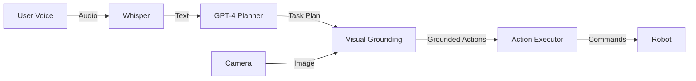
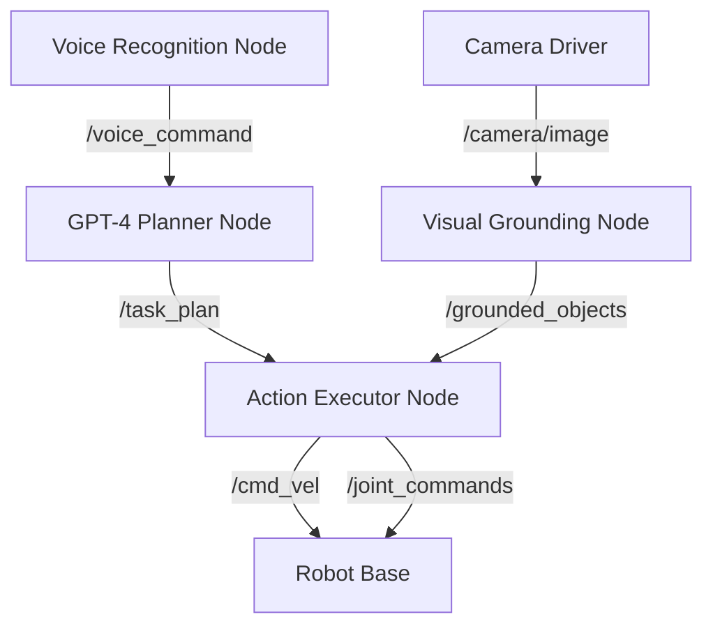

# Module 4: VLA Integration - Image Assets

This directory contains system architecture diagrams, flowcharts, and illustrations for Module 4: Vision-Language-Action Integration.

## Image List

### Architecture Diagrams

#### 1. VLA Pipeline Overview (`vla_pipeline_overview.png`)
**Description**: High-level VLA system architecture showing data flow from user input to robot action.
- Components: Whisper → GPT-4 → Vision System → Action Executor
- Shows message passing between ROS 2 nodes
- Includes feedback loops
- **Recommended dimensions**: 1920x1080 or SVG

#### 2. ROS 2 Node Graph (`ros2_vla_node_graph.png`)
**Description**: ROS 2 computational graph for VLA system.
- All ROS 2 nodes and topics
- Action servers and service calls
- Data flow directions with topic names
- **Format**: Generated from `rqt_graph` or manually created
- **Recommended dimensions**: 1600x1200

#### 3. Multi-Modal Fusion Architecture (`multimodal_fusion_architecture.png`)
**Description**: Detailed view of multi-modal fusion node.
- Input modalities: voice, vision, gesture
- Fusion mechanism (early vs. late fusion)
- Output to action planner
- **Recommended dimensions**: 1600x900

### Workflow Diagrams

#### 4. Voice Command Processing Flow (`voice_command_flow.png`)
**Description**: Step-by-step flow from voice input to action execution.
- Microphone capture
- Whisper transcription
- Intent parsing
- Action grounding
- Execution
- **Format**: Flowchart with decision nodes
- **Recommended dimensions**: 1200x1600 (vertical)

#### 5. Visual Grounding Process (`visual_grounding_process.png`)
**Description**: How CLIP and object detectors ground language in vision.
- Object detection (YOLO)
- CLIP embedding computation
- Similarity matching
- Bounding box selection
- **Recommended dimensions**: 1600x900

### Component Diagrams

#### 6. LLM Task Planner Internal (`llm_planner_internal.png`)
**Description**: Internal architecture of LLM task planner node.
- Prompt construction
- API call to GPT-4
- Response parsing
- Plan validation
- **Recommended dimensions**: 1400x1000

#### 7. Action Executor State Machine (`action_executor_state_machine.png`)
**Description**: State machine for action executor.
- States: Idle, Planning, Navigating, Manipulating, Error
- Transitions and conditions
- Timeout handling
- **Format**: UML state diagram
- **Recommended dimensions**: 1400x1000

### Example Screenshots

#### 8. RViz Visualization (`rviz_vla_screenshot.png`)
**Description**: RViz showing robot with detected objects and navigation goal.
- Robot model
- Object bounding boxes
- Navigation path
- Camera view
- **Format**: Screenshot from RViz
- **Recommended dimensions**: 1920x1080

#### 9. Isaac Sim VLA Scene (`isaac_sim_vla_scene.png`)
**Description**: Isaac Sim scene with humanoid robot and voice-controlled objects.
- Photorealistic rendering
- Labeled objects
- Robot in environment
- **Recommended dimensions**: 1920x1080

## Diagram Creation Tools

### Recommended Tools
1. **Draw.io** (diagrams.net) - Free, browser-based
   - Use for architecture and flowcharts
   - Export as PNG or SVG
   - Template available: `module4_diagram_template.drawio`

2. **Mermaid** - Text-based diagrams
   - Integrates with Markdown
   - Good for simple flowcharts and sequence diagrams

3. **PlantUML** - Code-based UML diagrams
   - Excellent for class and state diagrams
   - Can be versioned with Git

4. **Figma** - Professional design tool
   - For polished, publication-quality diagrams
   - Collaborative editing

### Style Guidelines
- **Colors**: Use consistent color scheme
  - Voice/Audio: Blue (#4A90E2)
  - Vision: Green (#7ED321)
  - Language/LLM: Purple (#BD10E0)
  - Action/Robot: Orange (#F5A623)
  - Error states: Red (#D0021B)

- **Fonts**:
  - Titles: Sans-serif, 18-24pt, bold
  - Labels: Sans-serif, 12-14pt
  - Code/topics: Monospace, 10-12pt

- **Layout**:
  - Left-to-right data flow (Western reading direction)
  - Top-to-bottom hierarchies
  - Consistent spacing and alignment

### File Formats
- **PNG**: For rasterized images (screenshots, photos)
  - Use 300 DPI for print quality
  - Optimize file size with tools like TinyPNG

- **SVG**: For vector graphics (diagrams, flowcharts)
  - Preferred for scalability
  - Smaller file size
  - Embed fonts or convert to paths

## Mermaid Examples

### VLA Pipeline (Mermaid)

### ROS 2 Node Graph (Mermaid)

## Placeholder Instructions

Until diagrams are created, this directory serves as a placeholder. Docusaurus will handle missing images gracefully with alt text.

## Copyright and Attribution

All diagrams should be original or properly licensed. For third-party diagrams, include attribution in figure captions.

---

**Note**: High-quality diagrams significantly enhance understanding of complex systems. Invest time in clear, professional visualizations.
